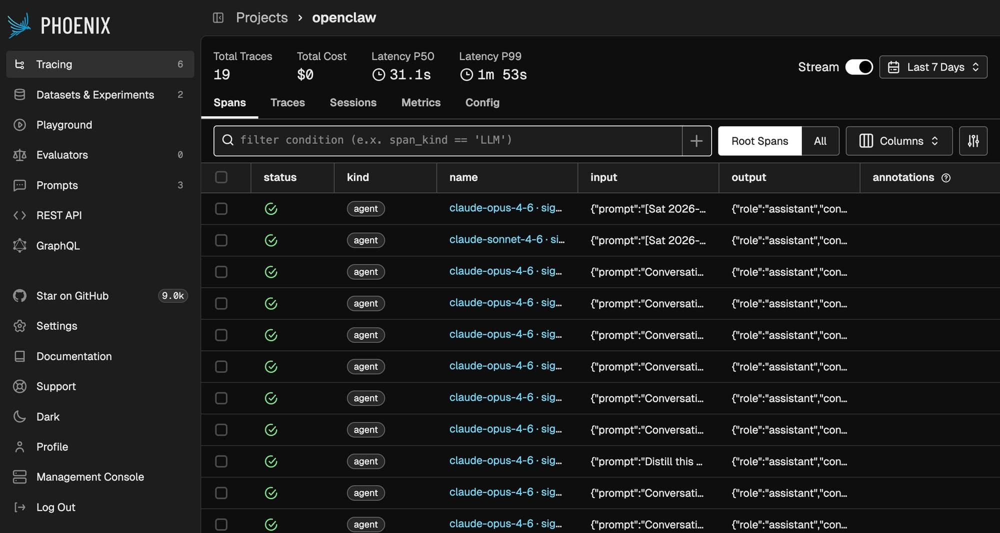
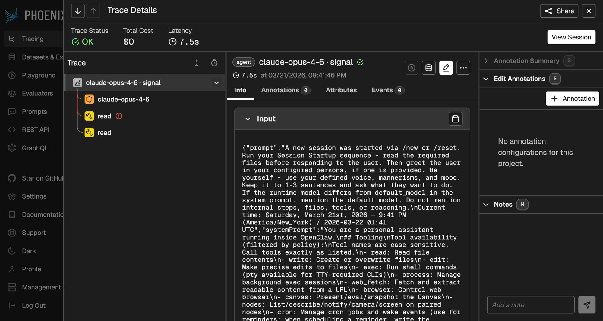

# OpenClaw Phoenix OTEL Plugin

Export full agent traces from [OpenClaw](https://github.com/openclaw/openclaw) to [Phoenix (Arize)](https://phoenix.arize.com) via OpenTelemetry.





## What it captures

- **LLM prompts and responses** (full input/output content)
- **Tool calls** with inputs, outputs, and errors
- **Sub-agent lifecycle** spans
- **Token usage** (prompt, completion, cache read/write)
- **Cost metadata** from diagnostic events
- **Proper span hierarchy**: AGENT → LLM → TOOL
- **OpenInference semantic conventions** for native Phoenix rendering

## Install

```bash
openclaw plugins install ./openclaw-phoenix-otel
```

## Configure

Add to your `~/.openclaw/openclaw.json`:

```json
{
  "plugins": {
    "allow": ["phoenix-otel"],
    "entries": {
      "phoenix-otel": {
        "enabled": true,
        "config": {
          "endpoint": "https://app.phoenix.arize.com/s/your-space",
          "apiKey": "your-phoenix-api-key",
          "projectName": "openclaw",
          "serviceName": "openclaw"
        }
      }
    }
  }
}
```

Then restart the gateway:

```bash
openclaw gateway restart
```

## Config options

| Option | Default | Description |
|--------|---------|-------------|
| `endpoint` | `https://app.phoenix.arize.com` | Phoenix collector endpoint |
| `apiKey` | — | Phoenix API key (Settings → API Keys) |
| `projectName` | `openclaw` | Phoenix project name |
| `serviceName` | `openclaw` | OTEL service name |

Environment variables `PHOENIX_HOST`, `PHOENIX_API_KEY`, and `PHOENIX_PROJECT_NAME` are also supported.

## How it works

The plugin hooks into OpenClaw's plugin SDK events:

- `llm_input` → creates root AGENT span + child LLM span with prompt content
- `llm_output` → sets response content, token counts on LLM span
- `before_tool_call` / `after_tool_call` → creates TOOL spans with I/O
- `agent_end` → finalizes the trace with metadata and cost
- Diagnostic `model.usage` events → accumulates cost/token metadata

Spans use [OpenInference semantic conventions](https://github.com/Arize-ai/openinference) so Phoenix renders them natively with proper LLM trace visualization.

## Notes

- Disable the built-in `diagnostics-otel` plugin to avoid conflicts (two OTEL providers in the same process can interfere)
- OTEL exports use `Authorization: Bearer <key>` for the OTLP endpoint (not `api_key` header)
- The plugin initializes OTEL during `register()` to ensure hooks can create spans immediately

## Credits

Forked from [@opik/opik-openclaw](https://github.com/comet-ml/opik-openclaw), adapted for Phoenix Cloud with OpenInference conventions.

## License

Apache-2.0
